# 🏗️ ERP Project — Architecture Graph

## 📊 High-Level Architecture

```mermaid
graph TB
    subgraph Entry["🚀 Entry Point"]
        main["main.dart"]
    end

    subgraph Core["⚙️ Core Layer"]
        config["Config"]
        theme["Theme"]
        widgets["Widgets"]
        utils["Utils"]
        security["Security"]
    end

    subgraph Router["🔀 Router"]
        app_router["app_router.dart"]
    end

    subgraph Services["🔧 Services Layer"]
        auth_svc["AuthService"]
        admin_svc["AdminService"]
        student_svc["StudentService"]
        teacher_svc["TeacherService"]
        hr_svc["HRService"]
        leave_svc["LeaveService"]
        fees_svc["FeesService"]
        events_svc["EventsService"]
        timetable_svc["TimetableService"]
        cache_svc["CacheManager"]
        offline_svc["OfflineService"]
        supabase_svc["SupabaseService"]
        pdf_svc["StaffPDFService"]
    end

    subgraph Features["📦 Feature Modules"]
        auth["🔐 Auth"]
        dashboard["📊 Dashboards"]
        student["🎓 Student"]
        teacher["👨‍🏫 Teacher"]
        admin["🛡️ Admin"]
        hod["👔 HOD"]
        hostel["🏠 Hostel"]
        transport["🚌 Transport"]
        admission["📝 Admission"]
        leads["📈 Leads"]
        leave["🌴 Leave"]
        hr["👥 HR"]
        fees["💰 Fees"]
        notices["📢 Notices"]
        timetable["🗓️ Timetable"]
        splash["✨ Splash"]
    end

    subgraph Backend["☁️ Backend"]
        supabase["Supabase DB"]
        firebase["Firebase Hosting"]
    end

    main --> app_router
    app_router --> Features
    Features --> Services
    Services --> supabase
    Core --> Features
    Core --> Services
```

---

## 📦 Feature Modules — Detailed Breakdown

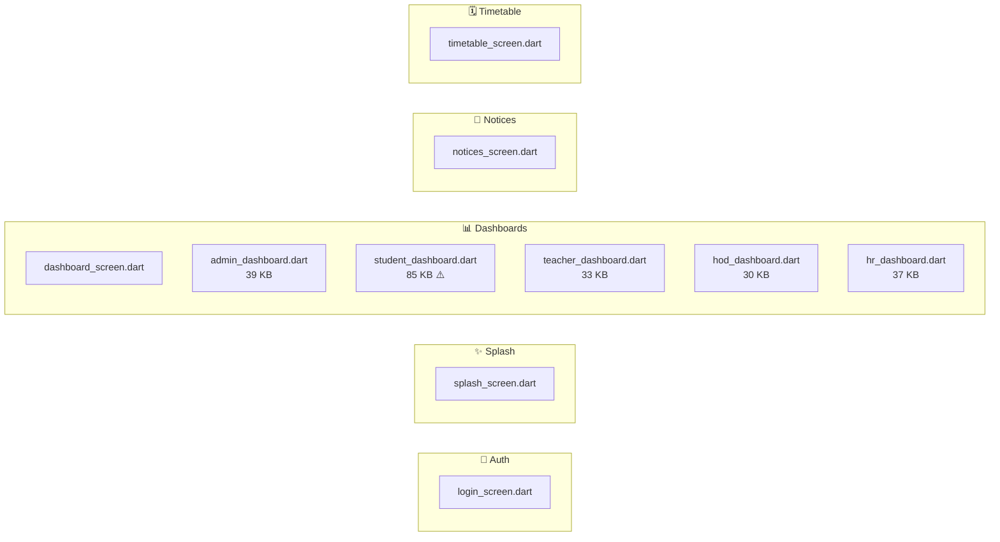

---

### 🎓 Student Module (16 files)

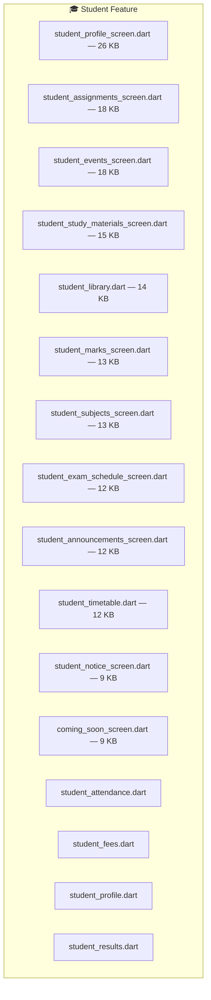

### 👨‍🏫 Teacher Module (12 files)

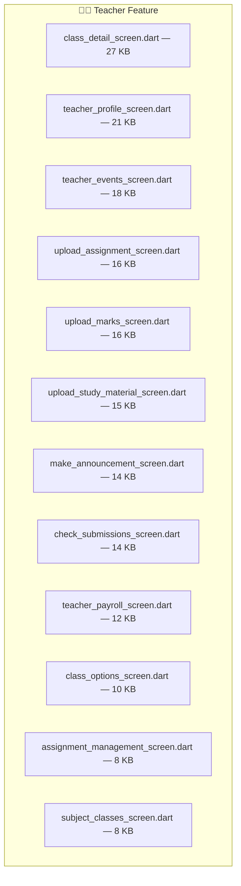

### 👔 HOD Module (6 files)

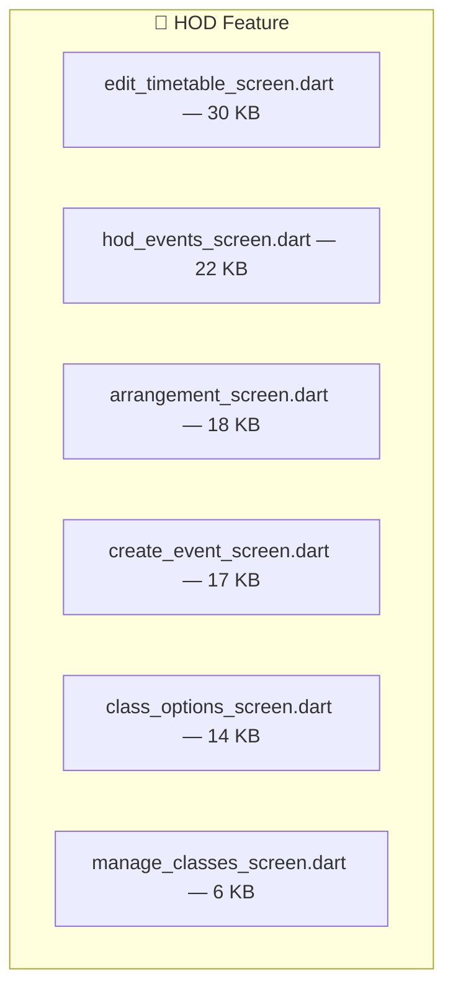

### 🏠 Hostel Module (10 screens + 2 services)

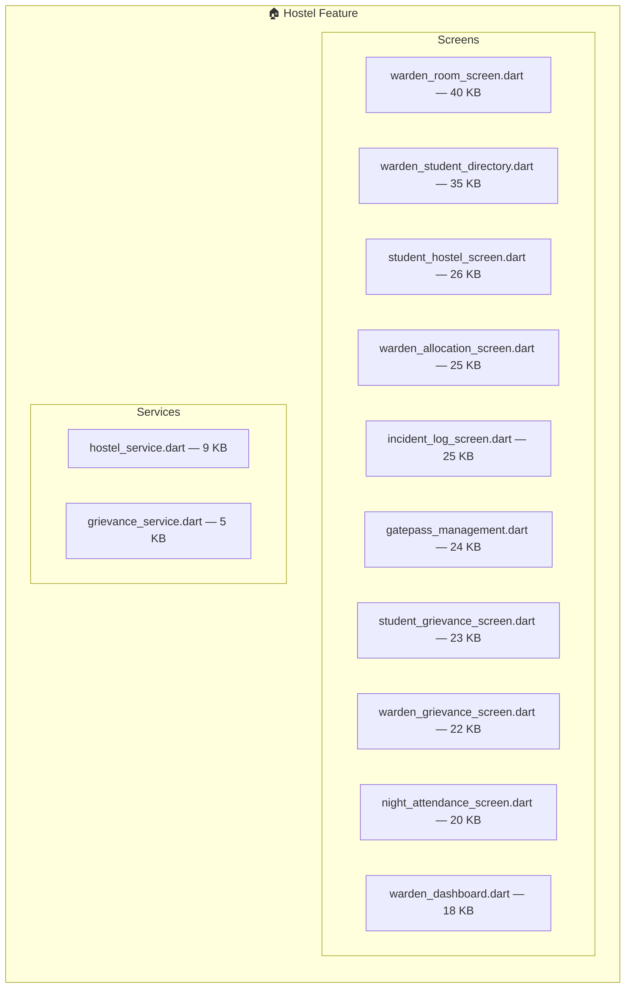

### 📈 Leads Module (6 screens + 4 services + 3 models + 5 widgets)

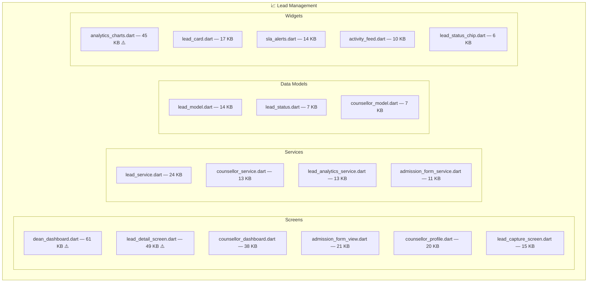

### 👥 HR Module (6 files)

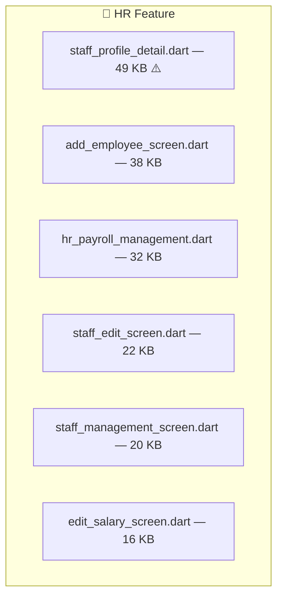

### 🌴 Leave Module (4 files)

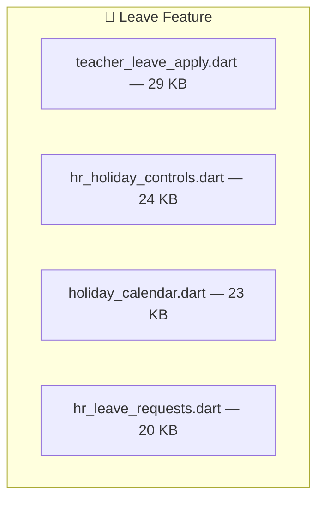

### 📝 Admission Module (5 screens + 1 service)

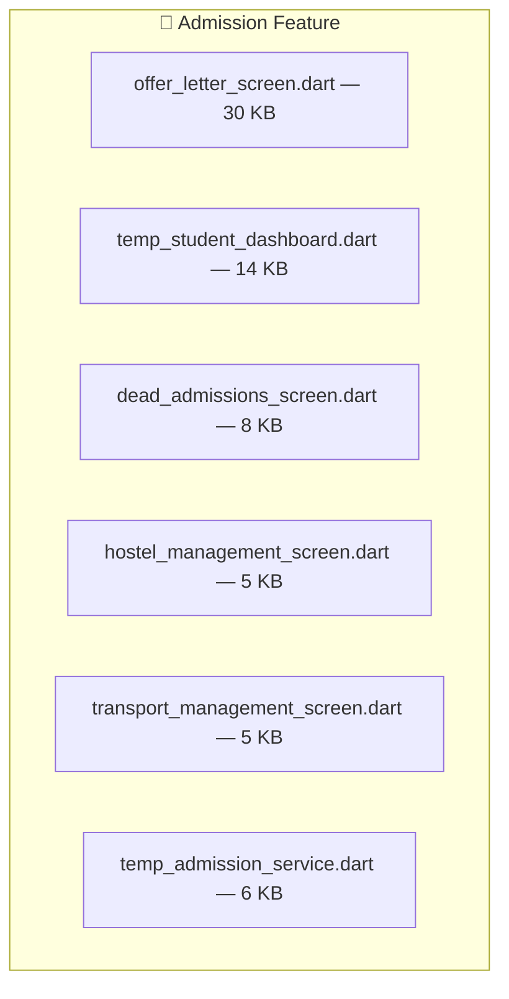

### 🚌 Transport Module (1 screen + 1 service)

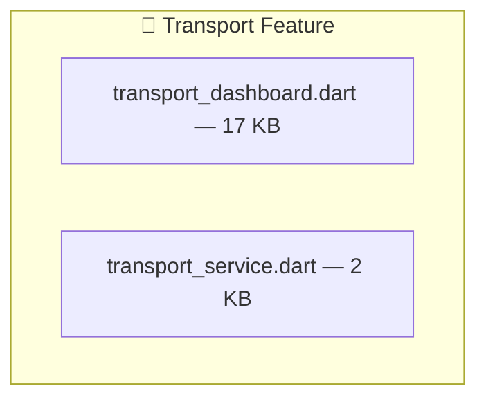

### 💰 Fees Module (3 files)

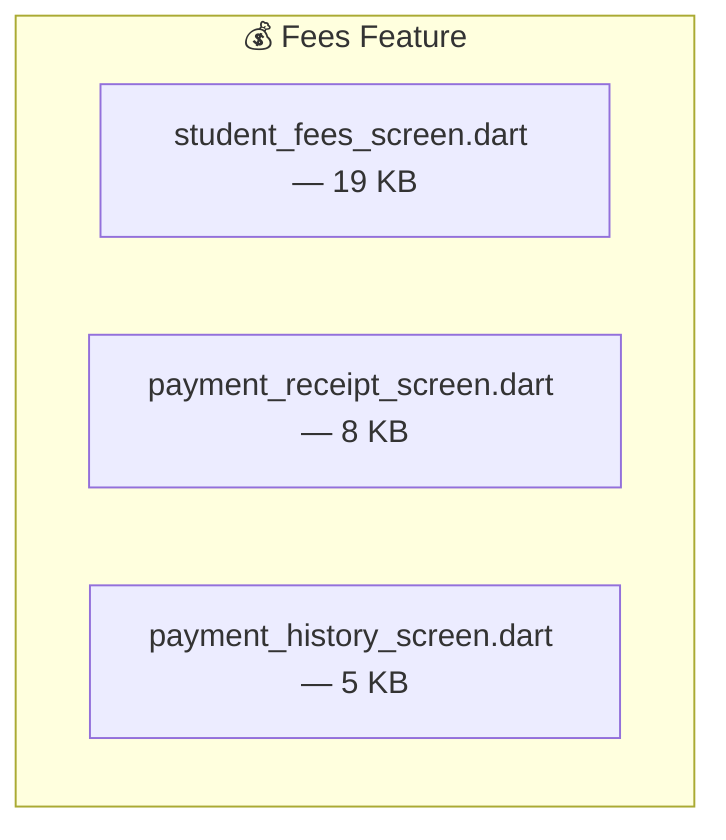

### 🛡️ Admin Module (3 files)

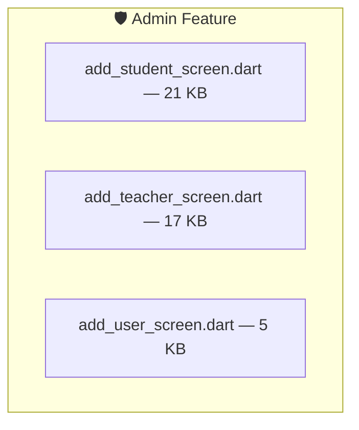

---

## ⚙️ Core Infrastructure

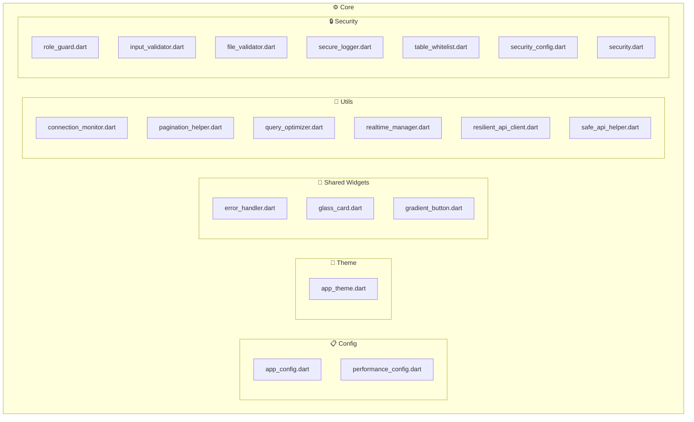

---

## 🔧 Services Layer

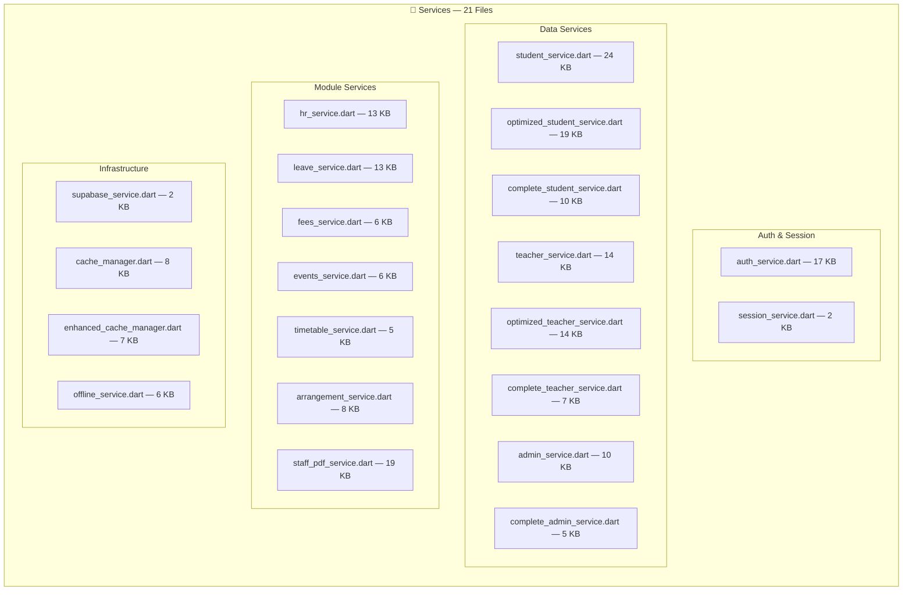

---

## 🗄️ Database & Backend

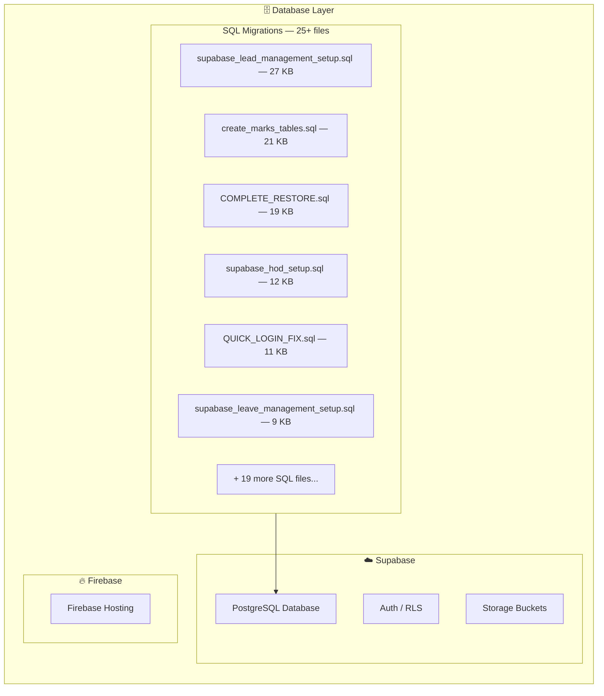

---

## 📁 Full Directory Tree

```
erp/
├── 📄 main.dart                          ← Entry Point
├── 📂 core/
│   ├── 📂 config/
│   │   ├── app_config.dart
│   │   └── performance_config.dart
│   ├── 📂 theme/
│   │   └── app_theme.dart
│   ├── 📂 widgets/
│   │   ├── error_handler.dart
│   │   ├── glass_card.dart
│   │   └── gradient_button.dart
│   ├── 📂 utils/
│   │   ├── connection_monitor.dart
│   │   ├── pagination_helper.dart
│   │   ├── query_optimizer.dart
│   │   ├── realtime_manager.dart
│   │   ├── resilient_api_client.dart
│   │   └── safe_api_helper.dart
│   └── 📂 security/
│       ├── file_validator.dart
│       ├── input_validator.dart
│       ├── role_guard.dart
│       ├── secure_logger.dart
│       ├── security.dart
│       ├── security_config.dart
│       └── table_whitelist.dart
├── 📂 routes/
│   └── app_router.dart
├── 📂 services/                           ← 21 service files
│   ├── auth_service.dart
│   ├── admin_service.dart
│   ├── student_service.dart
│   ├── teacher_service.dart
│   ├── hr_service.dart
│   ├── leave_service.dart
│   ├── fees_service.dart
│   ├── events_service.dart
│   ├── timetable_service.dart
│   ├── arrangement_service.dart
│   ├── staff_pdf_service.dart
│   ├── supabase_service.dart
│   ├── session_service.dart
│   ├── cache_manager.dart
│   ├── enhanced_cache_manager.dart
│   ├── offline_service.dart
│   ├── optimized_student_service.dart
│   ├── optimized_teacher_service.dart
│   ├── complete_student_service.dart
│   ├── complete_teacher_service.dart
│   └── complete_admin_service.dart
├── 📂 debug/
│   ├── database_debug_screen.dart
│   └── storage_debug_screen.dart
└── 📂 features/                           ← 16 feature modules
    ├── 📂 auth/             → 1 screen
    ├── 📂 splash/           → 1 screen
    ├── 📂 dashboard/        → 6 dashboards
    ├── 📂 student/          → 16 screens
    ├── 📂 teacher/          → 12 screens
    ├── 📂 admin/            → 3 screens
    ├── 📂 hod/              → 6 screens
    ├── 📂 hostel/           → 10 screens, 2 services
    ├── 📂 transport/        → 1 screen, 1 service
    ├── 📂 admission/        → 5 screens, 1 service
    ├── 📂 leads/            → 6 screens, 4 services, 3 models, 5 widgets
    ├── 📂 leave/            → 4 screens
    ├── 📂 hr/               → 6 screens
    ├── 📂 fees/             → 3 screens
    ├── 📂 notices/          → 1 screen
    └── 📂 timetable/        → 1 screen
```

---

## 📈 Stats at a Glance

| Metric | Count |
|---|---|
| **Feature Modules** | 16 |
| **Total Dart Screen Files** | ~82 |
| **Service Files** | 21 (global) + 8 (feature-local) |
| **Data Model Files** | 3 |
| **Widget Files** | 8 (3 core + 5 leads) |
| **Security Files** | 7 |
| **SQL Migration Files** | 25+ |
| **Backend** | Supabase (DB + Auth + Storage) |
| **Hosting** | Firebase |

---

## ⚠️ Large Files (>30 KB) — Potential Refactoring Candidates

| File | Size | Module |
|---|---|---|
| `student_dashboard.dart` | **85 KB** | Dashboard |
| `dean_dashboard.dart` | **61 KB** | Leads |
| `staff_profile_detail_screen.dart` | **49 KB** | HR |
| `lead_detail_screen.dart` | **49 KB** | Leads |
| `analytics_charts.dart` | **45 KB** | Leads/Widgets |
| `warden_room_screen.dart` | **40 KB** | Hostel |
| `admin_dashboard.dart` | **39 KB** | Dashboard |
| `add_employee_screen.dart` | **38 KB** | HR |
| `counsellor_dashboard.dart` | **38 KB** | Leads |
| `hr_dashboard.dart` | **37 KB** | Dashboard |
| `warden_student_directory.dart` | **35 KB** | Hostel |
| `teacher_dashboard.dart` | **33 KB** | Dashboard |
| `hr_payroll_management.dart` | **32 KB** | HR |
| `offer_letter_screen.dart` | **30 KB** | Admission |
| `hod_dashboard.dart` | **30 KB** | Dashboard |
| `edit_timetable_screen.dart` | **30 KB** | HOD |

---

## 🔄 Dependency Flow

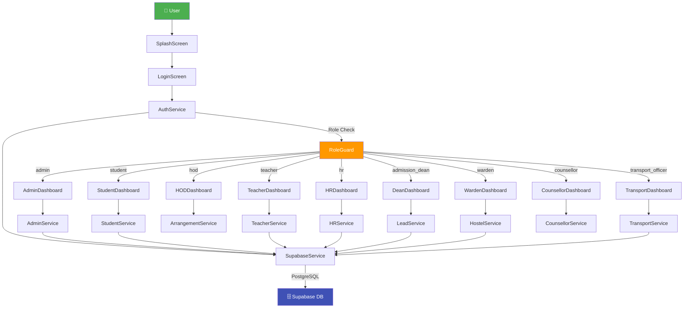
